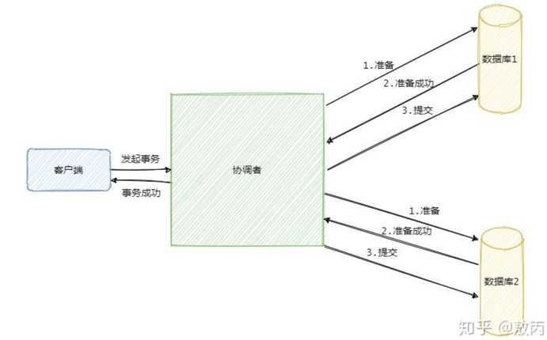
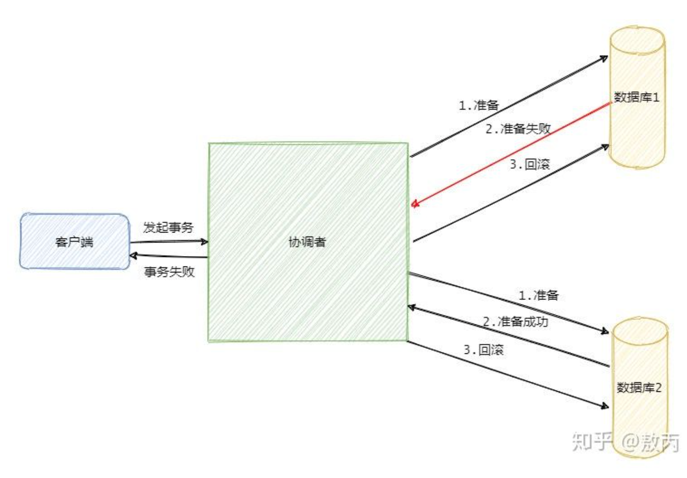
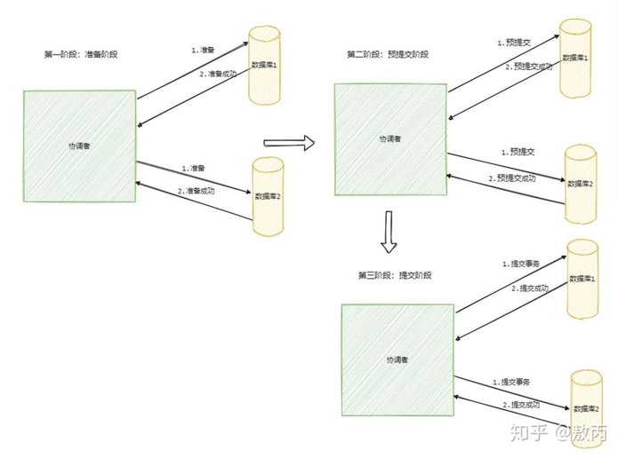
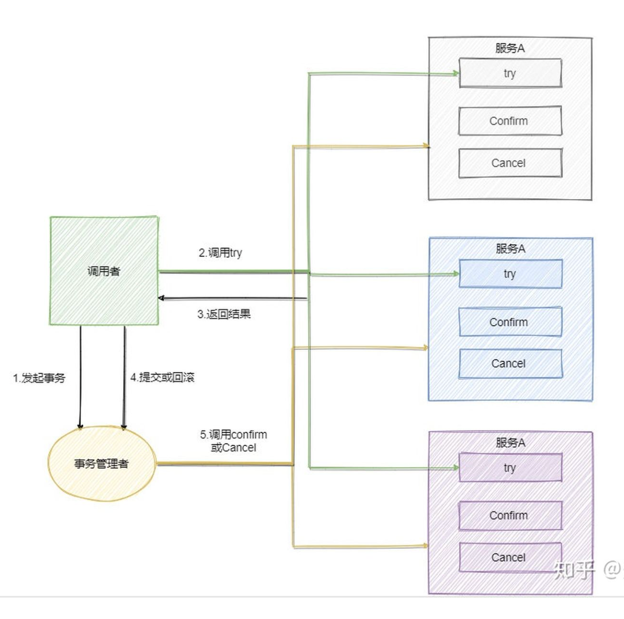

#分布式：有多个节点分布在不同的服务上；

##CAP理论：分布式系统中无法同时满足3个特性，最多只能满足2个特性。必须满足CAP中的P，然后在C/A之间做选择；
Consistency一致性：指的是强一致性，各节点的数据都保持一致；
    强一致性：各个节点的数据都保持一致；
    弱一致性：部分节点不是一致数据；
    最终一致性：经过一段时间后，各个节点的数据都保持一致；
Availability可用性：每次向节点发送请求，总能保证收到响应数据，允许不是最新的数据；
    若要保证一致性：则节点间同步数据期间必须锁定数据，导致读取数据失败，破坏了可用性；
    若要保证可用性：则不允许节点同步期间锁定数据，破坏了一致性；
Partition tolerance分区容错性：
    在单个节点无法使用的情况下，不能影响系统的正常运行；

##BASE理论：对CAP理论中的一致性和可用性权衡的一个结果。核心思想：当无法做到强一致时，根据业务特点采用适当的方式达到最终一致性；
Basically Available（基本可用）
Soft state（软状态）
Eventually consistent（最终一致性）

##分布式事务：在分布式系统中完成事务，由多个本地事务构成；
2PC：二阶段提交，一种强一致性设计。2PC中引入一个事务协调者来协调参与者的提交和回滚。
二阶段分别指准备（投票）和提交两个阶段；

准备阶段：协调者会给各参与者发送准备命令，只有全部参与者都准备成功才能进行提交阶段；
提交阶段：提交事务或回滚事务；

3PC：三阶段提交，包括准备，预提交和提交阶段。相对于2PC增加了预提交阶段，都不能保证数据的强一致性；

TCC（Try、Confirm、Cancel）、补偿事务：2PC和3PC是数据库层面的事务，而TCC是业务层面的事务，和业务紧密耦合，侵入性比较大；
思想和2PC差不多，都是试探性的提交，如果都可以执行那就真正的执行，如果不行就回滚；
Try：试探性的执行；
Confirm：确认；
Cancel：撤销；

消息事务：利用RabbitMQ和RocketMQ中的事务机制；

本地消息表：利用各个系统本地数据库的事务。通常在数据库建立一个本地事务表，将各个服务的执行和消息一起放入事务中，
在执行失败时，定时筛选出未成功的消息再调用对应的服务，调用成功再更新相应的消息；

最大努力通知：通常是发起方尽最大努力后仍然无法发送消息给接收方，这个时候需要通知方主动查询接收方的消息；

##幂等性：对同一操作发起的一次或多次请求，结果是一致的，不会因为多余的请求而改变结果；
- 查询操作：在数据不变的情况下，多次查询的结果是一样的，具有天然的幂等性；
- 删除操作：在数据不变的情况下，多次删除的数据对结果不会产生影响，具有天然的幂等性；
- 修改操作：需要分场景。
    设置一个值为多少的操作具有幂等性；
    增加或者减少的操作不具有幂等性；
