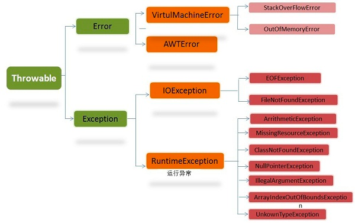

异常: 使用异常来提供一致的错误报告模型，使得构建能够与客户端代码可靠的沟通问题;  
      
    Exception: 
        1.检查异常: IOException,SQLException。需要在编译期间手动处理;
        2.非检查异常: 运行时异常，代表编程中无法预料的错误;
    检查异常与非检查异常之间转换: 使用异常链(例如: throw new RuntimeException(检查型异常对象));
    
异常处理两种模型:
    1.终止模型:
        一旦异常被抛出，就表明错误无法返回，也不能回来继续执行;
    2.恢复模型:
        修正错误后，继续执行程序;

自定义异常:
    继承Exception;

多重捕获异常:
    1.catch(异常1 ｜ 异常2 e)
      catch(异常3 ｜ 异常4 e)
    2.catch(异常1 ｜ 异常2 ｜ 异常3 ｜ 异常4 e)

栈轨迹: 先进后出，后进先出;
    printStackTrace方法中的信息可以通过getStackTrace方法直接访问。这个方法返回一个栈元素数组，其中每个元素是栈中的一桢;
    1.元素0是栈顶元素，调用序列中的最后一个方法;
    2.数组最后一个元素是栈底元素，调用序列中的第一个方法;

fillStackTrace:
    清空栈中之前的异常信息，把当前调用栈信息填入原来异常对象;
    与throw new 异常类型()功能相似;

异常链:
    捕获一个异常后抛出另一个异常，把原始异常信息保存下来，传给另一个异常的构造器;
    Throwalbe子类中，Error，Exception和RuntimeException这3种异常构造器可以保存原始异常信息;

finally: 
    作用:
        1.当要把除内存之外的资源恢复到它们的初始状态时。如文件，网络连接等;
        2.异常被抛出，但程序没有捕获;
    执行时机:
        1.finally总会执行(前提是程序没有退出: 执行System.exit(0));
        2.finally有返回值时，只会返回finally中的值; 
        3.finally没有返回值，try或catch有返回值时。先会保存try或catch中的值，等finally执行完后，再返回try或catch中的值;
        4.嵌套finally: 先执行完内部finally，再去处理外部异常以及外部异常的finally;
异常缺失:
    1.当finally中有异常抛出时，try和catch中抛出的异常会被忽略，只会抛出finally中的异常;
    2.finally中只有return时，try和catch中抛出的异常会被忽略;

try-with-resources: 不需要手动在finally处理关闭操作; 
    所有实现Closeable接口的对象都可以使用此表达式;
    表达式: try(){}。 '()'内的部分称为资源规范头，可以定义多个对象，这些对象必须实现java.lang.AutoCloseable接口。
    '{}'跟以前一样进行逻辑处理。
    使用表达式无论你如何退出try块，和以前的finally子句等价的代码依旧都会执行(若catch住，则在catch之前执行)，且按创建对象相反的顺序关闭;
    注意点:
        1.定义对象时，构造器发生异常不会close;
        2.不在'()'中定义的对象，不会被close;

异常匹配:
    抛出异常的时候，会按照catch顺序捕获异常，只会被一个catch捕获;
    catch(基类类型 t): 会捕获所有派生类的异常;

