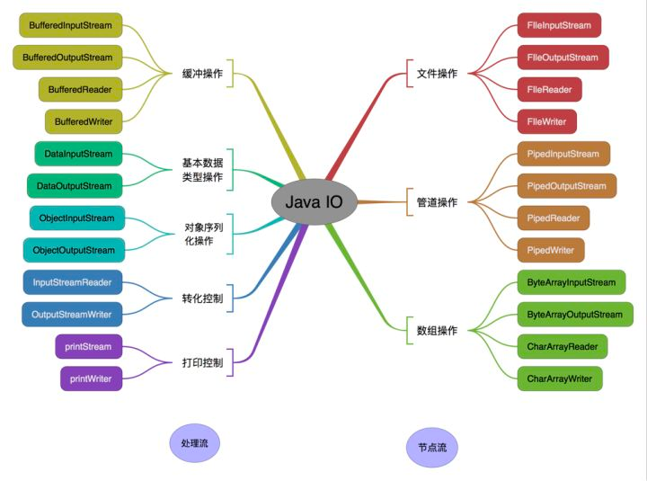

# IO:

1.按流的流向分: 输入流和输出流;
2.按操作单元分: 字节流和字符流;
3.按流的角色分: 节点流(节点之间的读写)和处理流(对节点流的装饰处理);

## nio: 
non-blocking，非阻塞输入输出流;

## 文件操作的两个基本组件:
1.文件或者目录的路径;
2.文件;

## System:
1.out: 输出系统信息;

## Files:
1.Files.walkFillTree(dir,SimpleFileVisitor): 遍历所有子目录和文件;
    1.通过重写SimpleFileVisitor中的visitFile和postVisitDirectory方法，可以实现删除文件和删除目录;
    visitFile和postVisitDirectory方法需要返回标志位决定是否继续访问其他文件或其他目录;
2.createDirectory: 创建目录;
3.createFile: 创建文件;
4.copy: 复制文件;
5.createTempFile: 创建临时文件;
6.createDirectory: 创建临时目录;
7.newDirectoryStream: 创建流目录;
8.walk: 获取目录树全部内容的流;
9.readAllLines: 按行读取读取一个文件内容;
10.write: 写入一个文件;

## Path:
1.normalize: 转化'.','..'符号为真实目录;
2.选取路径部分片段:
    可以生成路径的一部分，通过实现Iterable，遍历Path对象不包含根路径;
3.增减修改:
    1.relativize: 移除Path根路径;
    2.resolve: 添加Path尾路径;

## Paths:
1.get: 生成Path对象;   

## 路径监听:
通过WatchService设置一个对Path操作(ENTRY_CREATE，ENTRY_DELETE 或 ENTRY_MODIFY(其中创建和删除不属于修改))的响应;
通过watcher.take()等待并阻塞。当目标事件发生时，返回一个WatchEvent和WatchKey对象;

## 文件查找:
FileSystems.getDefault().getPathMatcher(模式: 1.glob:**/*.{tmp,txt}(符号'**/'表示当前目录及所有子目录) 2.regex);

        
