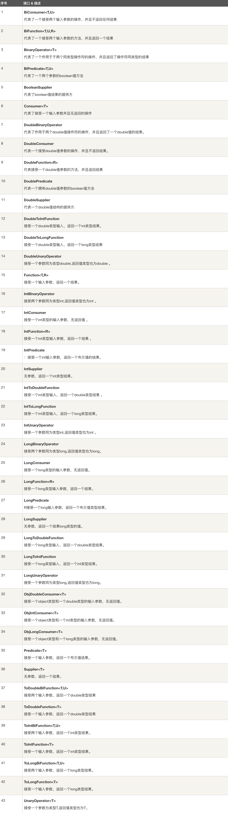

# lambda表达式: 只需要一个函数式接口对象，直接作用于函数式接口;
例子: new Thread(() -> {}).start();
lambda表达式(() -> {})返回的是一个接口(Runnable)实例对象，且该接口只有唯一抽象方法(run);

## 表达式语法:

使用lambda表达式，需要使用函数式接口;
函数式接口：接口中只有唯一一个抽象方法，可以有多个非抽象方法。
可以使用@FunctionalInterface注解定义为函数式接口，编译器会验证接口中抽象方法只能为一个，重写Object中的方法不算在内;

## lambda表达式实际是返回一个接口实例对象:

## 使用lambda表达式注意点:
1.表达式返回的是接口的实例对象;
2.参数数量，是否需要返回值，返回值类型，可以选择合适的函数式接口;
可以参考jdk自带的函数式接口，在java.util.function包中;

## jdk函数式接口:

常用:
    1.Function: R apply(T t);
    2.Supplier: T get();
    3.Consumer: void accept(T t);
    4.Predicate: boolean test(T t);
    

## 高级函数:
一个消费或产生函数的函数;
使用继承可以为专用函数式接口创建别名;
要消费一个函数，必须在参数列表正确的描述函数类型;
在高级函数中，应用于lamdba表达式中的局部变量是等同final效果的的常量;

## 函数组合:
多个函数组成新函数;

## 柯里化:
将一个多参数的函数，转换为一系列单参数函数;
    
    