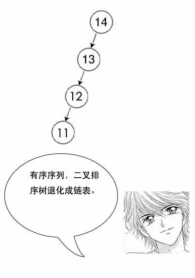
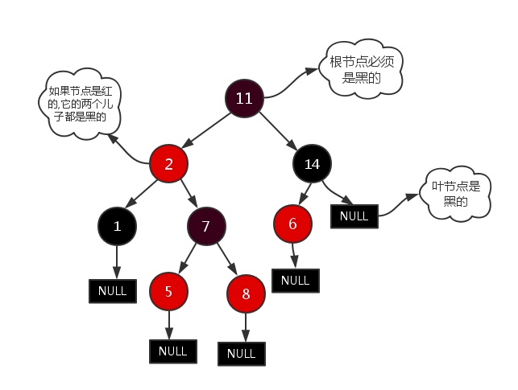

树形图：
引用文章：
    1.图解二叉排序树，平衡树，红黑树，B树，B+树(https://blog.csdn.net/qq_29373285/article/details/88610654)    

二叉树：

二叉搜索树或二叉排序树或二叉查找树：
    
    1.所有非叶子节点最多有2个子节点；
    2.所有节点存储一个关键字；
    3.非叶子节点左指针指向小于其关键字的子树，右指针指向大于其关键字的子树；
    左边数据比跟节点小，右边数据比跟节点大。并且左右子树都是二叉排序树。
    极端并发情况下，二叉排序树会退化成链表；
    
    这种情况下需要用到平衡树，在插入的时候调整这棵树，让节点尽可能均匀分布；

红黑树或二叉平衡树：
    
    针对二叉搜索树的一种改进；
    每个节点非黑即白，跟节点是黑的，叶子节点是黑的。如果一个节点是红的，子节点都是黑的。
    对于任意节点，它到叶子节点的每条线路都包含有相同数目的黑节点。主要用于查找，插入和删除；

多叉树：

B树或B-树：
    多叉搜索树；
    根节点至少有2个子节点，子节点的数量<=树的层级；
    每个节点都存放有关键字和索引，并且一个关键字只存在一个节点中；
    常用于磁盘读写，提高IO性能。数据和索引存在于磁盘，数据过大不能一次性加载进内存使用，可以每次加载一个节点然后一步步往下找；

B+树：
    多叉搜索树；
    B树的一种变种，为了提高查找效率；
    非叶子节点只保存索引，不保存关键字，叶子节点通过链表连接，查找效率较高，关键字只存在叶子节点中。
    相比于B树层级更少，查询数据更快。
    常用于文件系统和数据库中；
    数据批量查询时，B要做局部中序遍历，可能要跨层访问。B+树数据都存在叶子节点，不用跨层，只需要找到收尾通过链表查找所有数据；

