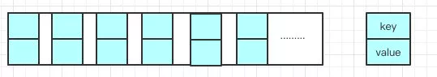

引用文章： 1.https://blog.csdn.net/zhengwangzw/article/details/104889549
2.https://mp.weixin.qq.com/s/0Gf2DzuzgEx0i3mHVvhKNQ

内部数据结构和数据结构之间的转换：

数组中的每个节点存有：hash,key,value,下一个节点

数据结构：数组+链表+红黑树 key产生hash碰撞时，数组节点转变为链表； 链表长度>8并且数组长度>=64，链表转变为红黑树； 红黑树节点<6，红黑树转变为链表；

put原理：

get原理：

扩容方式： 条件：容量*负载因子(0.75)
步骤： 1.创建新数组，长度为原来的2倍 2.rehash：遍历原数组数据重新hash到新数组 公式：index = HashCode（Key） & （Length - 1）

1.8链表从头插改为尾插：头插在多线程扩容时，会改变链表顺序，造成环形链表；

线程安全替代类： 1.HashTable：方法锁 2.CurrentHashMap：对象锁，分段锁，多线程操作只会锁住当前操作索引的节点

3.Collections.syschronizedMap 排斥锁和方法锁

如何解决hash冲突： 1.开放地址法 hash后节点发生冲突，依次往后面的节点存数据 2.链地址法 hashMap中使用的方法，当hash冲突后，在该节点转换为链表或红黑树

