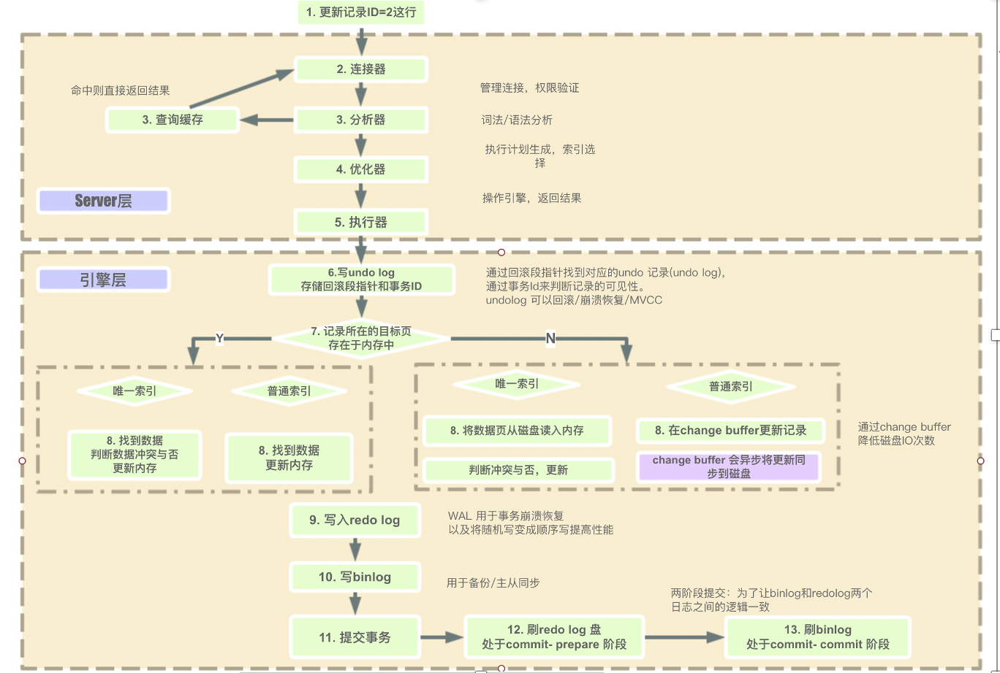
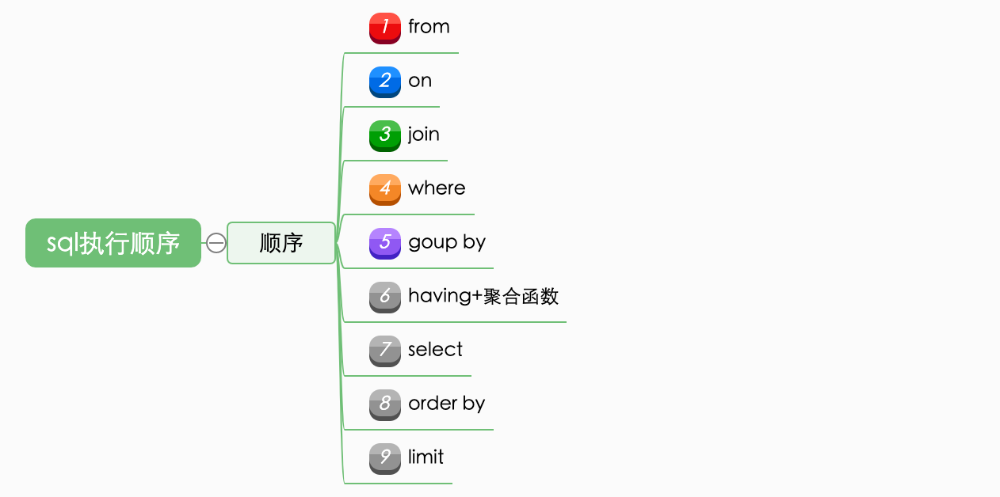
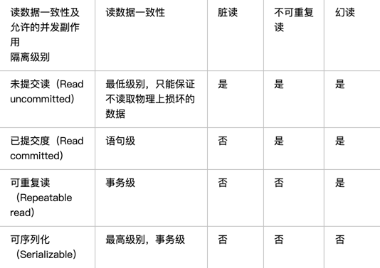
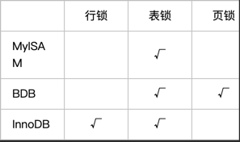

#MYSQL

##整体执行过程

##SQL执行过程

##事务
###ACID
原子性：事务是一个原子操作单元。对数据的修改，要么全部执行，要么全部不执行；
一致性：在事务开始和结束后，数据都必须保持一致的状态。意味着应用于事务修改后的数据是预期数据；
隔离性：表示事务之间是有隔离性的。事务的中间处理过程是不可见的，只有事务处理完后，才能看到处理结果；
持久性：表示事务完成后，对数据的修改是永久性的；

###并发事务带来的问题
脏读：在一个事务中读取到另一个事务修改但未提交的数据；
脏写、更新丢失：多个事务在修改同一个数据时，最后提交的事务更新会覆盖其他事务的更新；
幻读：在一个事务中多次用相同条件查询数据时，其他事务对这个条件结果集做了新增或者删除操作，导致多次查询的结果集不一样；
不可重复读：在一个事务中多次用相同条件查询数据时，其他事务对这个条件结果集做了修改操作，导致多次查询的数据不一样；
###幻读和不可重复读的区别：
「幻读」主要指多条数据的新增和删除操作、『不可重复读』指一条数据的修改操作；

###事务隔离级别

##索引
主键索引：唯一，非空
唯一索引：唯一，允许空
普通索引：不唯一，允许空
组合索引：多个列组合成的索引，遵从最左前缀原则，只有where条件中有使用组合索引中的第一个列才会使用索引；
###索引失效
使用了!=
like ‘%’ 开头；
强制类型转换，查询一个varchar字段不加单引号；
or语句前后字段都需要创建索引；
在索引字段使用计算操作；
在索引字段使用了聚合函数；
组合索引没有采用最左前缀原则；

##MYSQL优化
创建表遵守三大范式；
采用合适的字段类型；
采用合适的存储引擎；
采用合适的索引；
查询sql语句的优化；
读写分离；
分库分表，使用mycat工具；
exists是对外表做循环查询，每一个循环查询都会与内表做关联查询，而关联查询字段一般会加索引。适合内表大外表小的场景；
in是先对内部做查询，然后再与外表做关联查询。适合外表大内表小的情况；
not in是全表扫描，不会走索引。可以使用not exists代替；

##锁

从开销、加锁速度、死锁、粒度、并发性能：
表锁：开销小，加锁快，不会产生死锁，锁粒度大，并发度最低；
行锁：开销大，加锁慢，会产生死锁，锁粒度小，并发度高；
页锁：会出现死锁，其他介于表锁和行锁之间；
###InnoDB锁：表级锁和行级锁共存
行锁：
    共享锁：S锁，允许事务读一行数据，阻止其他事务获得相同数据集的排它锁；
    排它锁：X锁，允许获得排他锁的事务更新数据，阻止其他事务获得相同数据集的共享读锁和排他写锁；
表级所、意图锁：
    意向共享锁：IS锁，事务想要获得一张表中某几行的共享锁；
    意向排它锁：IX锁，事务想要获得一张表中某几行的排它锁；
意图锁遵循如下协议：
在事务获得某行的共享锁之前，必须首先在表上获得意向共享锁；
在事务获得某行的排它锁之前，必须先手在表上获得意向排它锁；

间隙锁：使用范围条件查询数据时，不在范围记录中的数据也会加锁。为了防止幻读；

自增锁：指事务在插入一个自增长列的值时，必须先获得该列的自增锁，以便获得自增长的值；

