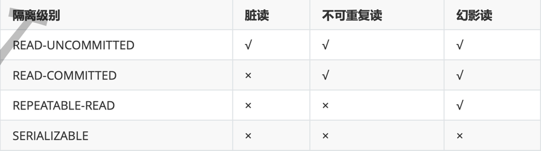

#Mysql

##count(1)、count(*)和count(column)的区别:
从执行结果看count(1)和count(*)没有区别。count(column)会过滤null行数据；

##事务
并发事务问题
脏读：一个事务读取另一个事务中未提交的数据；
幻读：一个事务读取另一个事务提交的新增数据；
不可重复读：一个事务读取了另一个事务已经提交的更改(更改或者删除)数据；
丢失修改：

事务隔离级别：  

##表级锁和行级锁
表级所防止新增
行级锁防止修改

    