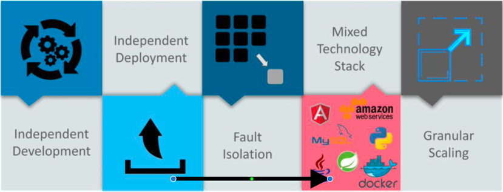
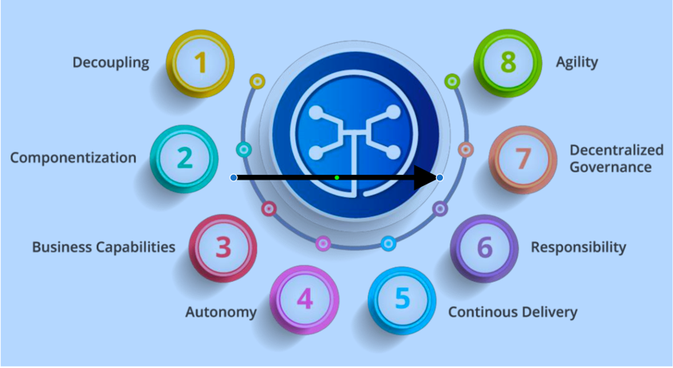
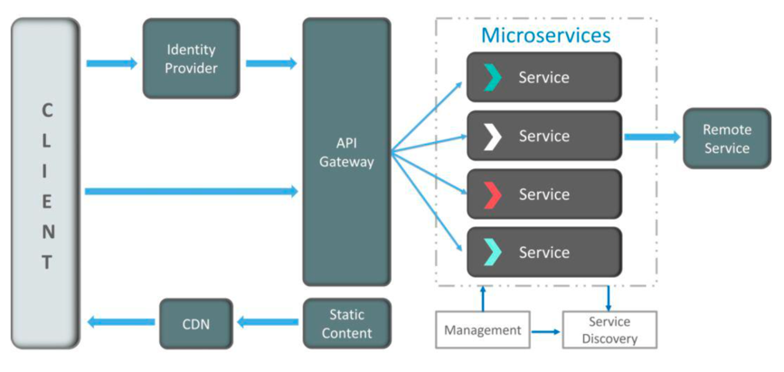

##微服务：一种项目架构风格。当单一架构臃肿时，将其按业务拆分成多个小服务分别治理；

###微服务优势：  
- 独立开发：可以单独定制化开发；
- 独立部署：单独部署；
- 故障隔离：分区容错性；
- 混合技术堆栈：基于不同的语言和技术构建；
- 粒度缩放：可以根据功能大小定制化服务；  
优缺点对比：  

###微服务的特点：
1.解耦 2.组件化、3.业务能力、4.自治、5.持续交付、6.责任、7.分散治理、8.敏捷；

###微服务架构：

